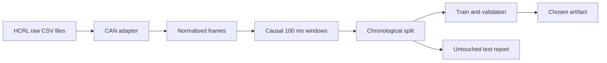

# CAN model training: the engineer's guide

This guide builds the machine-learning portion of the final-year CAN intrusion project. It takes HCRL Car-Hacking CSV files, creates causal time-window features, trains three models, chooses a model with validation data, and reports results on a held-out test interval.

## What we are predicting

Each raw CAN frame has a time, CAN identifier, length, payload bytes, and HCRL `Flag`. HCRL marks ordinary frames `R` and injected frames `T`.

We do not predict per frame. The system groups the last 100 ms of traffic into one feature vector and predicts whether the window is **normal** or **suspicious**. A 100 ms window is a starting point: it is short enough to make a live alert feel immediate but long enough to calculate timing statistics. Later compare 100, 250, and 500 ms using validation data.

The predictor never receives `Flag`, raw filename, capture ID, attack type, row number, or an absolute timestamp as a feature. Those values could make a model look accurate while learning the dataset layout rather than network behaviour.

## Architecture



## 1. Download and place the dataset

Request the dataset from the official HCRL page and retain its required paper citations:

https://ocslab.hksecurity.net/Datasets/car-hacking-dataset

Put the downloaded CSV files here. Do not rename them to vague names because filenames help record provenance and identify documented attack datasets.

```text
data/can/raw/
  normal.csv
  DoS_dataset.csv
  Fuzzy_dataset.csv
  gear_dataset.csv
  RPM_dataset.csv
```

These files are ignored by Git, so the repository remains small and does not redistribute the dataset.

## 2. Create the Python environment

From the repository root in PowerShell:

```powershell
.venv\Scripts\Activate.ps1
pip install -r requirements.txt
```

The project needs `scikit-learn` for the comparison baselines and `python-dotenv` because the API imports it.

## 3. Normalise raw files

The HCRL columns are expected to be timestamp, CAN ID, DLC, DATA[0] through DATA[7], and Flag. The adapter accepts spaces/underscore variants, converts hexadecimal IDs into integers, rejects broken timestamp/ID/DLC rows, and writes a manifest with a SHA-256 hash for each original file.

```powershell
python feature_engineering/can_adapter.py --input data/can/raw/normal.csv data/can/raw/DoS_dataset.csv data/can/raw/Fuzzy_dataset.csv data/can/raw/gear_dataset.csv data/can/raw/RPM_dataset.csv
```

Check `data/can/manifests/dataset_manifest.json`. If malformed rows are high, stop and inspect the source CSV rather than training anyway.

## 4. Build causal windows

```powershell
python feature_engineering/can_features.py --input data/can/processed/*_normalised.csv --window_ms 100
```

PowerShell expands the `*_normalised.csv` files. If your terminal does not, write their paths explicitly.

Features are calculated only from frames within the current window:

| Feature | Meaning |
|---|---|
| `frames_per_second` | Traffic volume in the window |
| gap statistics | Timing regularity and flooding behaviour |
| `burst_fraction` | Fraction of inter-frame gaps under 1 ms |
| `unique_id_count`, `id_entropy` | How varied the observed traffic IDs are |
| DLC statistics | Message length behaviour |
| `dominant_id_fraction` | Whether one CAN ID dominates traffic |

`target=1` only records whether any HCRL-injected frame occurred in that window. It is a label, never a feature. `attack_fraction` is retained for analysis but is never model input.

## 5. Train and evaluate

```powershell
python model/train_can.py --dataset data/can/processed/can_windows_100ms.csv
```

The command compares logistic regression, Random Forest, and the existing residual PyTorch MLP. It chooses by validation F1, then reports the selected model only once on the test interval.

Outputs are stored in `artifacts/can_timing_v1/`:

- `model_metadata.json`: feature order, class map, normalisation, threshold, and selected model.
- `model.pt` or `model.joblib`: active model artifact.
- `training_report.json`: split sizes, attack-window counts, validation comparison, and held-out test metrics.

## 6. Understand the split before trusting a result

Every recording is split by time: first 60% for training, middle 20% for validation, final 20% for test. One window on both sides of each boundary is discarded. This prevents a model from seeing directly adjacent feature windows in training and test.

This is stronger than random row splitting, but it is still a limitation: if HCRL has only one recording of a given attack, the test is a later portion of the same recording, not a new vehicle. State that honestly in the dissertation. A second independently captured dataset is the proper future validation.

## 7. Read the report

- **Precision:** fraction of alerts that were actual injected traffic.
- **Recall:** fraction of attack windows detected.
- **F1:** balance of precision and recall, used to choose a threshold.
- **PR-AUC:** quality across all thresholds; useful because attack windows are not the majority.
- **Confusion matrix:** `[[true normal, false alert], [missed attack, detected attack]]`.

Do not state an accuracy number alone. In an intrusion system a 99% accuracy can still be weak if it misses attacks or creates too many false alerts.

## 8. What happens next

After the first successful report, we will add a CAN inference service, timed replay, alert storage, live dashboard charts, false-alerts-per-minute, and attack-onset detection delay. Do not build those around a model until this pipeline gives reproducible results.

## Common problems

- **`No columns to parse`:** downloaded file is not a CSV or is empty; inspect it before continuing.
- **Many malformed rows:** source header differs from the documented format; share the first five lines with Codex and we will safely adapt the parser.
- **Only normal or only attack windows in validation/test:** the chronological boundary landed poorly; inspect attack periods and create an explicit episode-aware split manifest.
- **High scores:** verify that `FEATURE_COLUMNS` does not include labels, filename-derived values, or identifiers that only occur during one attack recording.
- **Memory pressure:** adapter reads in 200,000-row chunks. Reduce `--chunk_size 50000`; do not open all raw files in Excel.

## Viva explanation in one minute

“We treat every 100 ms of CAN traffic as a signal window. We calculate timing and traffic-distribution features without using payload labels or HCRL's attack flag. We split each recording chronologically and fit preprocessing using training data only. We compare interpretable baselines against a residual neural network, choose the threshold on validation data, and reserve the final interval for evaluation. The deployed dashboard replays recorded data and displays measured alerts, not a scripted result.”
